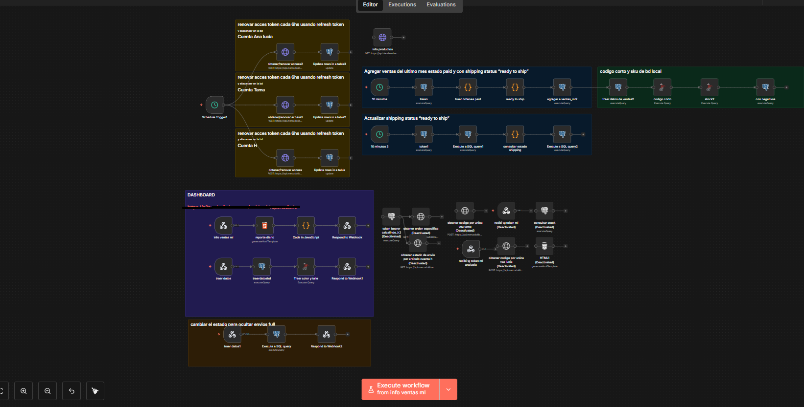
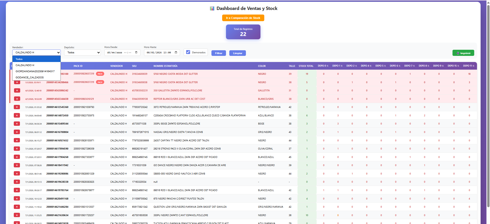

# Automatización de Ventas Mercado Libre – n8n

## Descripción general

Esta automatización corresponde a un **workflow de n8n orientado al análisis y gestión de ventas provenientes de Mercado Libre**.  
El flujo centraliza información de ventas, procesa los datos operativos y genera salidas estructuradas que pueden utilizarse para **reportes, control interno y toma de decisiones comerciales**.

El proyecto está pensado como una **automatización operativa**, no como un sistema contable ni ERP completo.

---

## Objetivo del workflow

- Obtener información de ventas de Mercado Libre.
- Normalizar y estructurar los datos recibidos.
- Procesar métricas relevantes (ventas, productos, montos).
- Preparar la información para reportes o integraciones posteriores.
- Reducir tareas manuales de control y seguimiento.

---

## Tecnologías utilizadas

- **n8n** (orquestador de la automatización)
- **Mercado Libre API** (fuente de datos)
- **JavaScript (Code Nodes)** para lógica y normalización
- **Webhooks / HTTP Requests**
- **Base de datos** (opcional, según implementación)
- **Email / Dashboard** (extensible)

---

## Flujo general de la automatización

### 1. Disparador del proceso
- Nodo: `Trigger / Webhook / Schedule`
- Permite:
  - Ejecución manual
  - Ejecución programada
  - Ejecución bajo demanda

---

### 2. Obtención de ventas
- Nodo: `HTTP Request`
- Consulta a la API de Mercado Libre:
  - Órdenes
  - Productos vendidos
  - Fechas
  - Montos
  - Estados de venta

---

### 3. Normalización de datos
- Nodo: `Code`
- Funciones principales:
  - Limpieza de campos
  - Conversión de formatos
  - Agrupación de ventas
  - Preparación de métricas clave

---

### 4. Procesamiento de métricas
Según configuración, el flujo puede calcular:
- Total de ventas
- Cantidad de órdenes
- Productos más vendidos
- Ventas por período
- Ingresos totales

---

### 5. Salida de información
El resultado puede enviarse a:
- Base de datos
- Email
- Dashboard
- Otro workflow
- Archivo (CSV / JSON)

---

## Estructura de salida (resumen)

Cada ejecución puede generar:
- Fecha de procesamiento
- Total de ventas
- Cantidad de operaciones
- Detalle por producto
- Estados de las órdenes

---

## Limitaciones conocidas

- Dependencia directa de la API de Mercado Libre.
- Manejo básico de errores.
- Lógica centralizada en Code Nodes.
- Sin control avanzado de reintentos.
- Sin conciliación contable.
- No contempla devoluciones o reclamos complejos.

---

## Valor del proyecto

- Automatiza la recolección de ventas.
- Centraliza información dispersa.
- Reduce errores manuales.
- Facilita análisis posterior.
- Base sólida para reportes comerciales.

---

## Posibles mejoras futuras

- Persistencia histórica en base de datos.
- Dashboard interactivo.
- Alertas automáticas.
- Comparativas por períodos.
- Integración con sistemas contables.
- Manejo avanzado de errores y retries.
- Modularización del workflow.

---

## Estado actual

🟢 Funcional  
🟡 En expansión  
🔵 Uso interno / operativo  

---

**Autor:** Santiago Perez Kay  
**Contexto:** Automatización de gestión de ventas de Mercado Libre desarrollada en n8n
